# Fabric Model → Azure ML Endpoint (via MLFlow)

Build a model in Microsoft Fabric, push it to Azure ML, and deploy it as a managed endpoint — all from a single notebook.

Fabric doesn't natively support deploying models to Azure ML, so we register an Entra ID app and use its credentials to push the model via MLFlow from the Fabric notebook into an Azure ML workspace.

## Prerequisites

- A Microsoft Fabric workspace
- An Azure ML workspace
- The notebook: [`Time series-413.ipynb`](Time%20series-413.ipynb) — import this into your Fabric workspace

This is a standard timeseries model example. **Step 1, Step 6, and Step 7** in the notebook are the relevant parts for the Fabric → Azure ML integration.

---

## 1. Register an App in Entra ID

Go to [entra.microsoft.com](https://entra.microsoft.com/).

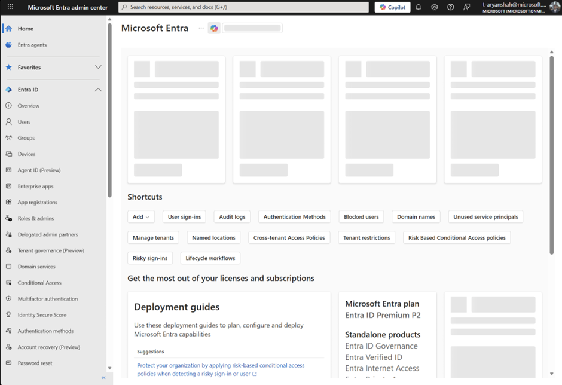

In the left sidebar, click **App Registrations** → **New registration**.

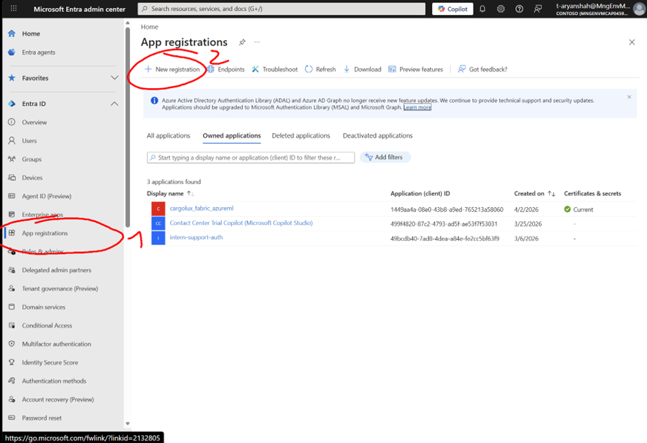

Give it a name and click **Register**.

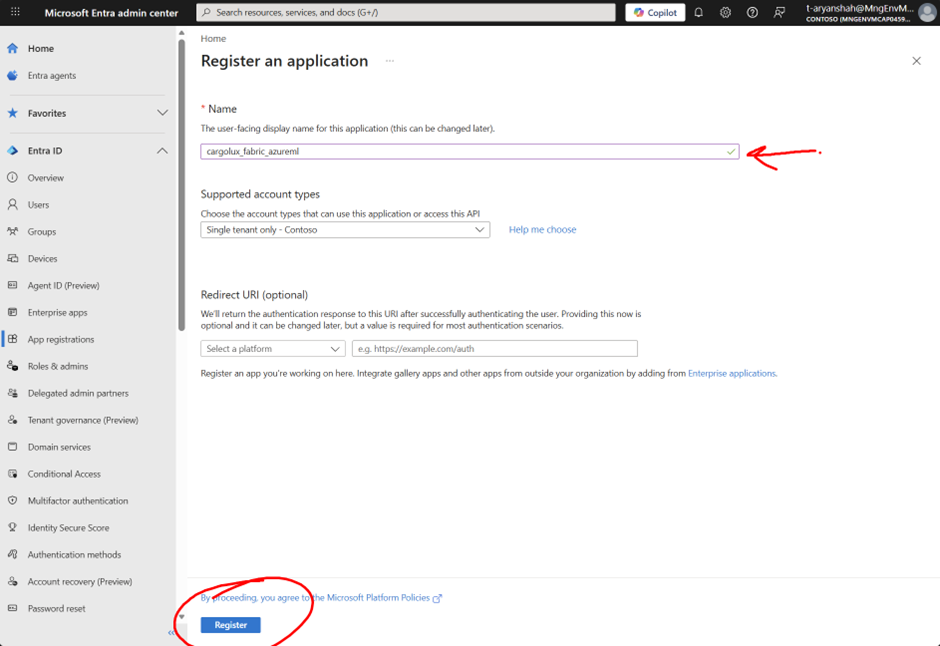

## 2. Save App Credentials

Copy the **Application (client) ID** and **Directory (tenant) ID** — you'll need these.

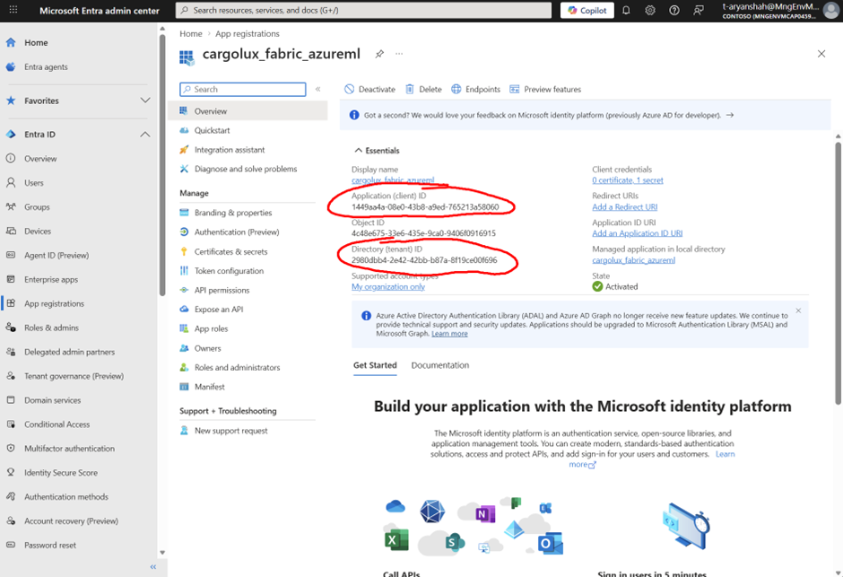

In the left sidebar of the app registration, go to **Certificates & secrets** → **New client secret** → **Add** (defaults are fine).

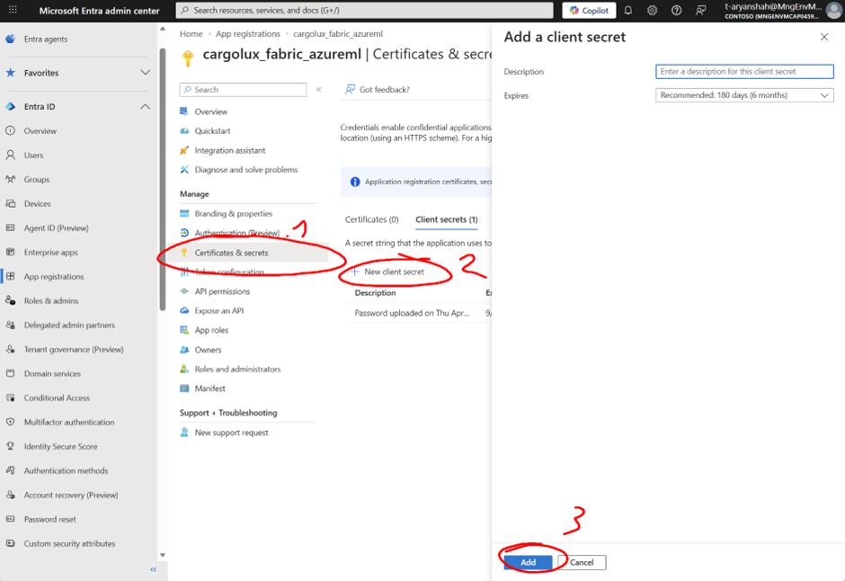

Copy the **Value** from your secret. This is your `client_secret` — save it.

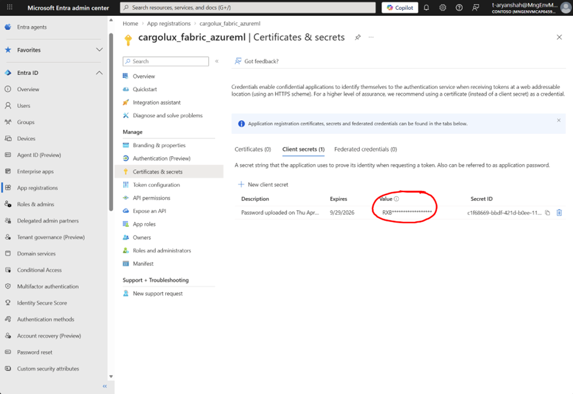

## 3. Configure the Fabric Notebook

In the Fabric notebook, go to **Step 1: Configurations** and find the first code block. Replace all the env values with the credentials you saved:

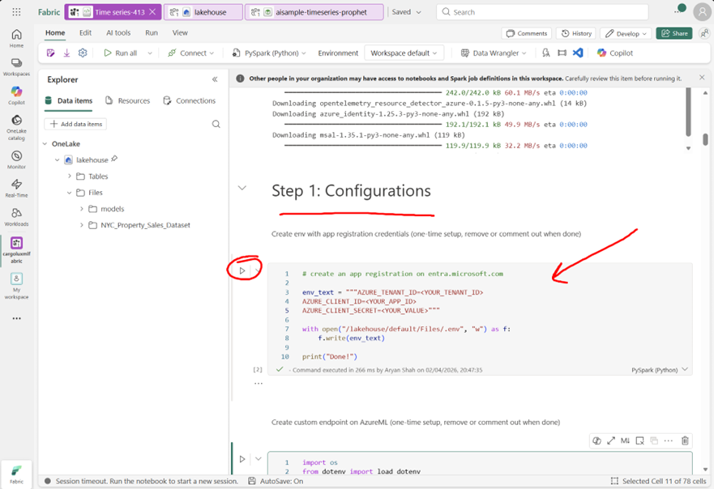

Run that cell. Once done, **delete it or comment it out** — you don't want credentials sitting in a cell.

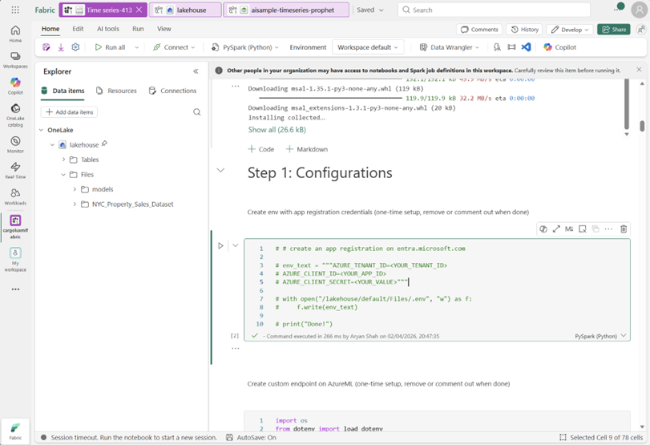

## 4. Grant Azure ML Access to the App

Go to [portal.azure.com](https://portal.azure.com/) and navigate to your Azure ML resource.

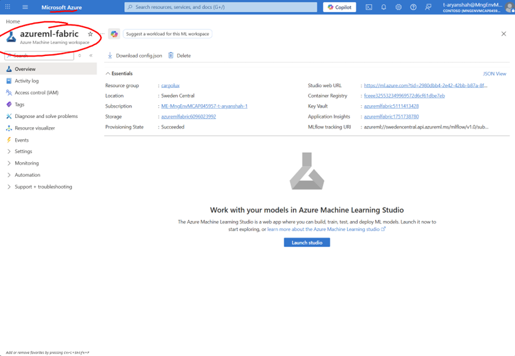

Go to **IAM** in the left pane → **Add** → **Add role assignment**.

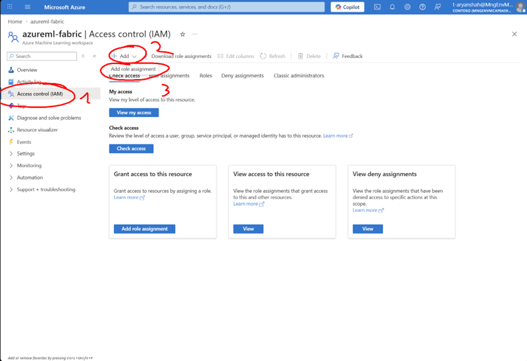

Search and select the role **AzureML Data Scientist**, click **Next**.

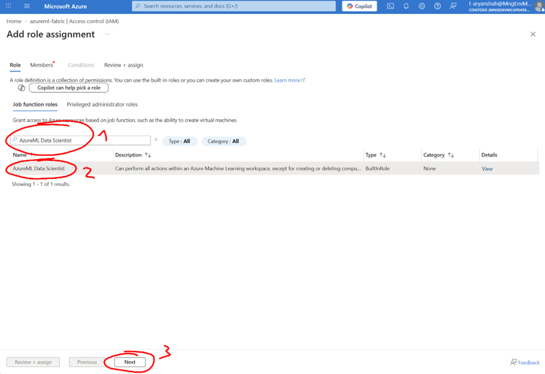

Click **Select members**, find your Entra app by name, click **Select** → **Review + Assign**.

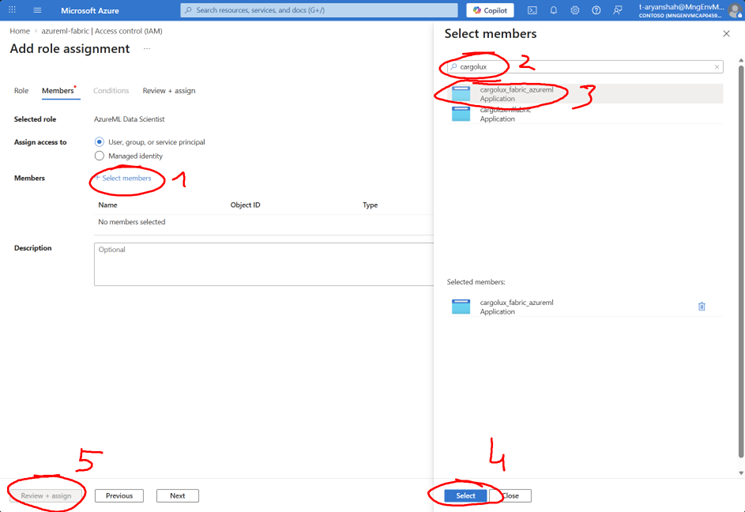

## 5. Create a Custom Environment

Automatic environments don't work when pushing a model from Fabric → Azure ML, so we create a custom one.

In the Fabric notebook, right under the config cell, there's a cell for custom environment creation on Azure ML. **Run it**.

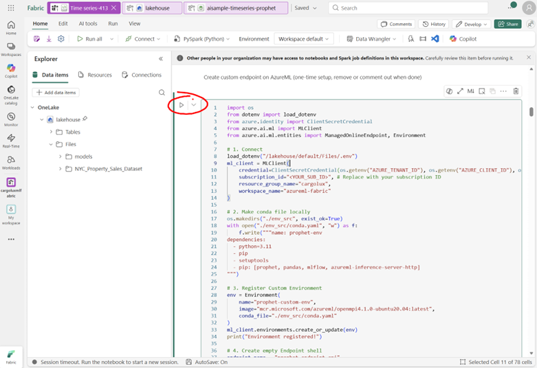

Once done, **comment it out** — you only need to create the environment once.

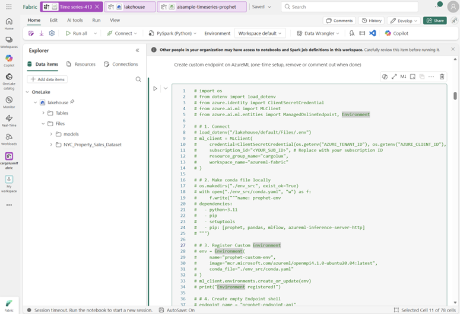

## 6. Run the Notebook

Go back to your Fabric workspace and **Run All**. The notebook will build the model, push it to Azure ML, and deploy it as a managed endpoint — all versioned automatically.

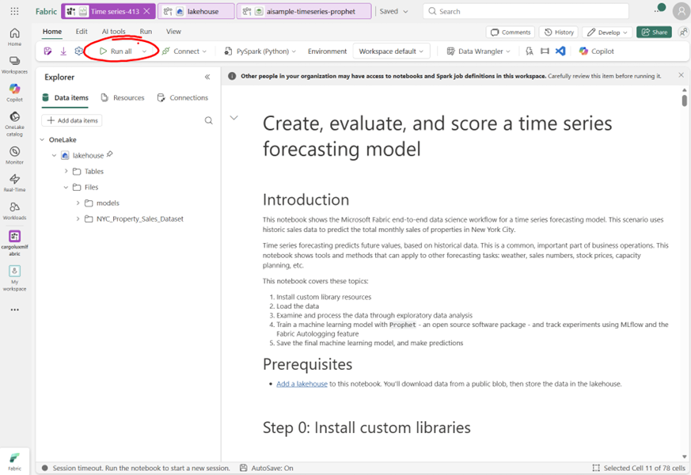

## 7. Verify in Azure ML

Go to [ml.azure.com](https://ml.azure.com/). In the left pane → **Models**. You'll see `my-prophet-model`. Multiple runs will auto-version.

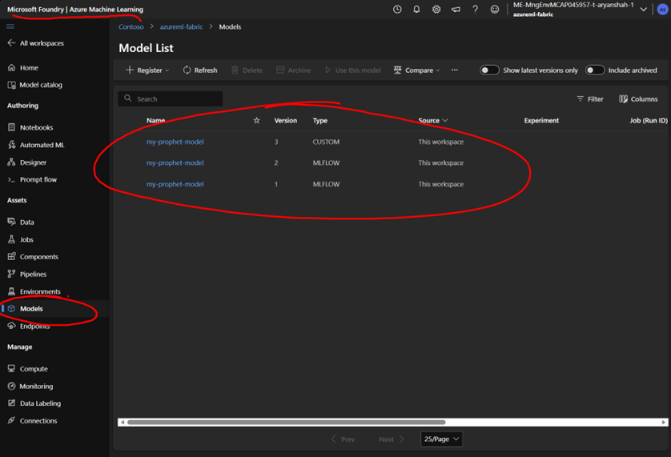

To test, go to **Endpoints** in the left pane and click on your endpoint.

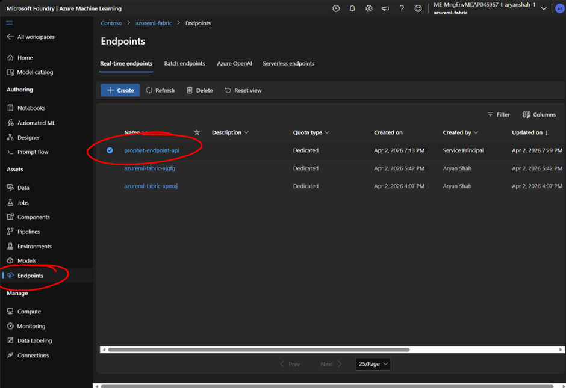

Go to the **Test** tab and use this input:

```json
{
  "input_data": {
    "columns": ["ds"],
    "data": [["2012-11-26"]]
  }
}
```

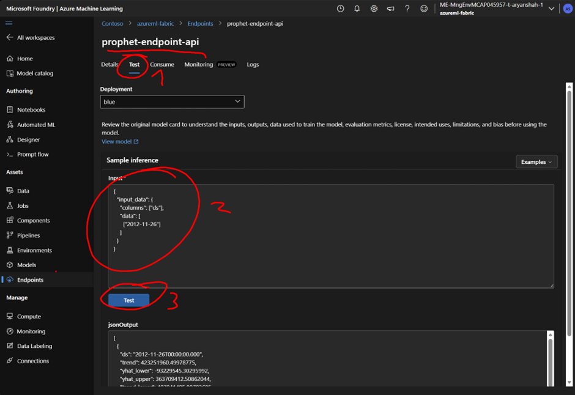

You'll see the predictions in the output. This endpoint can be called from anywhere — a Fabric ML pipeline developed and hosted as an Azure ML endpoint.

## Disclaimer

> [!WARNING]
> This repository is an **unofficial** guide. It is provided "as is" without warranty of any kind. Use at your own risk. The authors and contributors assume no liability for any damages or issues arising from its use. See the [LICENSE](LICENSE) for full terms.
